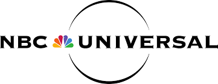
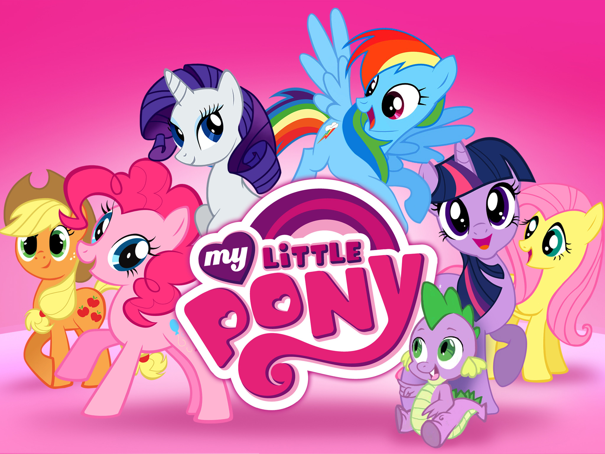
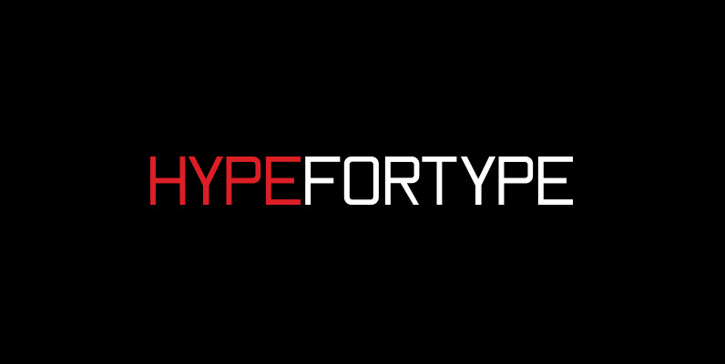
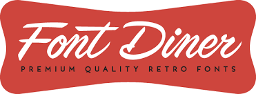
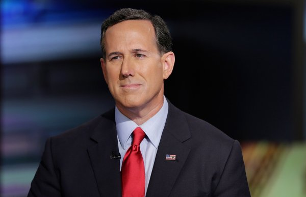

Typefaces, as we all know, are not copyrightable.

The actual form of the letters can not be protected by law; but fonts, the tiny digital files that contain the typeface in question, can be. Therefore, while copying the design or distributing the actual font would not be illegal, doing the same with the actual digital font file would be. This can make is incredibly difficult to try and copyright your own typeface, and especially difficult to try and find companies who may have exploited it. For larger typography companies though, its slightly easier, especialy when its another big business who has taken it. Below, we go through some of the most prominent lawsuits in font lisencing.

### **Brand Design Co. vs NBC Universal**

In 2012, Brand Design Co. sued entertainment giant NBC Universal over the alleged use of their typeface 'Chalet' on the company's websites. While Oxygen Media, a subsidary of NBCU, had puchased a lisence to the Chalet typeface, it was only a basic 36-user lisence. Evidence from the later settlement indicated that they typeface had been downloaded around 200,000 times. A New York Federal Judge dismissed the case in 2013, and the suit was settled outside of court. NBC Universal agreed to pay Brand Design Co. $175 for each infringement, adding up in the end to a whopping $3.5 million!

### Font Bros. v Hasbro

One of the most recent prominent legal disputes happened in 2016 when Minneapolis- based typography company Font Bros. sued Hasbro, the toy company responsible for the My Little Pony range. Allegedly, a typeface supplied by the Font Bros., 'Generation B', was used illegaly on both packaging and on the My Little Pony website itself, because Hasbro didn't possess the proper lisencing agreement. The typography company is suing for $150,000 per infringement, claiming they asked the toy company to pay the appropriate lisencing fee sveral times, but had they'd been continually refused.

### HypeForType vs Universal Music Studios

Another massive lawsuit over typography was served to Universal Music Studios in 2017 by HypeForType, the largest online font shop in Europe. They claimed that Universal Music had used their fonts 'Nanami Rounded' and 'Ebisu Bold' in the logo for popular British band The Vamps. This therefore meant the typefaces in question was used in artwork, promotional materials, merchandising and more for the band. Similar to NBCU, the designer of the logo Stuart Hardie had purchased a basic license for the fonts several years before, but Universal Music had never purchased the additional lisencing agreements for the logo to be used commercially.

HypeForType filed for $1.25 million and the destruction of all existing materials and merchandise, which would mean getting rid of every piece of merchandise and promotion ever created for the band, and starting from scratch.

### Font Diner v Mixpanel

Although neither of those names might sound familiar, you may recognise the name Tumblr. Font Diner, a retro themed typeface company, sued Mixpanel for $2 million in 2013, claiming Mixpanel had used their font 'Coffee Service' by embedding it in a Tumblr theme without the appropriate lisence. The suit was terminated less than 2 months later, settling out of court.

### Typotheque vs Rick Santorum/ RaiseDigital

Another typography legal dispute that reached mainstream media was in 2011, when Dutch typeface design company Typotheque filed a lawsuit against RaiseDigital, Santorum, and supposedly the America's Foundation PAC, although one of them were officially named as the defendent in the case. Allegedly, RaiseDigital, a business systems and web development company, had been commissioned by the America's Foundation PAC and by extension Santorum's campaign committee to help develop the Senator's website in his run for the US Presidency.

Typotheque is the copyright owner of the name of the typeface in question, 'FEDRA', that was used on the website. The original lawsuit was for $2 million, though its uncear how the case was actually resolved.