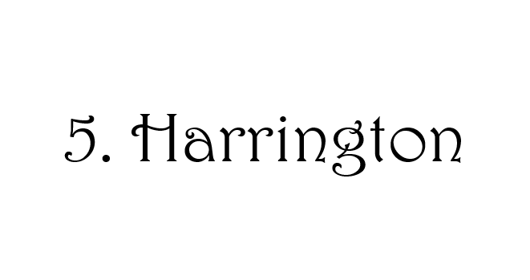

Coming in at the bottom spot on today's list is Biome. Now I wouldn't have previosusly considered putting Biome on this list until I saw that M. It hands down beats any other space-y computer-y typography. Never doing too much, but still doing enough. A full 6.5/10 from me.

I can't tell you exactly why I chose to put Eras Bold ITC on here either. I know its nothing special, but maybe that's why I like it. It seems like a totally basic font until you catch that little gap in the a, a cheeky twist on a classic. Another 6.5/10.

There is no other font like Jokerman. Its chaotic vibes are unmatched and its popularity is undeniable. Someone could kidnap me and as long as they wrote my ransom letter in Jokerman, I would say thank you. 7/10

I used to be a big fan of Brush Script MT, but over the last few years it seems to have lost its appeal somewhat. Its a good middle ground between Bradley Hand ITC and Blackadder ITC, and is still very cute. 7/10

STCaiyun, while not exactly my cup of tea, has definitely earnt its place on this list. It is the only font on Microsoft Office that is hollow! I know that doesn't sound right but its true, you can check! Plus I love its retro vibes- another 7/10 here.

Arguably the most beautiful, and by far the most fancy, Kunstler Script is an elegant font. It is far superior to the better known Blackadder ITC and yes this is the typography I will be using on my wedding invitations. 7.5/10, I wish I could write like this.

I love how retro Bauhaus 93 is. I can imagine it on a huge sign in some super cool diner/bar in central London where millenials hang out. Plus, I'm a sucker for the seventies- 8/10

Gosh do I love this font. Its fancy, but not pretentious. Classic, yet fun. If I was to get one of those plaques to put on a gate outside my house, this is the typography I would get in it. All those little serifs as well, adorable. Solid 8/10.

I love this font more than I can convey and I can't entirely explain why. Its big cute letters make me feel warm inside. Its name as well, Goudy Stout, means absolutely nothing and yet so much to me. I feel like it is the typographic embodiment of The Wind in the Willows, and again I can't explain why. Regardless, it gets an 8.5/10 from me.

Broadway does not get the credit it deserves in my opinion. Have you ever seen a typography represent an entire decade so well? I don't even have to say what decade I'm talking about because you already know! The holy grail of theatre typography, you can't deny that Broadway is iconic. 9/10.

A true gift of a font, Bradley Hand ITC is the perfect font to imitate actual handwriting. One time I wrote 36 page diary entry entirely in this font. Its cute, its fun, its practical. You can't complain! 9/10.

Coming in at number one is Modern Love Grunge. You may argue that this font is not worthy of the top spot on this list, and in many ways you're right. Goudy Stout has more character, Broadway is more popular, but in many other ways, this is my list so I can do what I want. Modern Love Grunge the original, its the only typography on Microsoft Office that features shading within the letters. Its warm and homely while also being edgy and cool. Everything about it reminds me of young adult fiction novels I used to read as a teenager. Multi-faceted and creative, Modern Love Grunge gets a 10/10 from me.