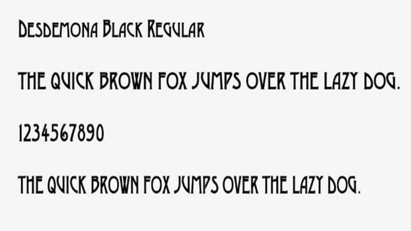

Its spooky season, and our font of the month is the beautiful Desdemona!

Originating in Vienna in the early ages, this elegant art deco font features uniformed spacing and beautiful curves. I've chosen it as this month's top typography because of its similary to the popular TV show American Horror Story, one of my favourite shows to binge over the spooky holiday season. 

While Desdemona was created when high- waisted capital alphabets were trending, since its revival by John McConnell in the 1960's, it would now look more in place on a modern witch's spellbook. Universally cherished and totally elegant, it's clear to see why Desdemona is our font of the month.